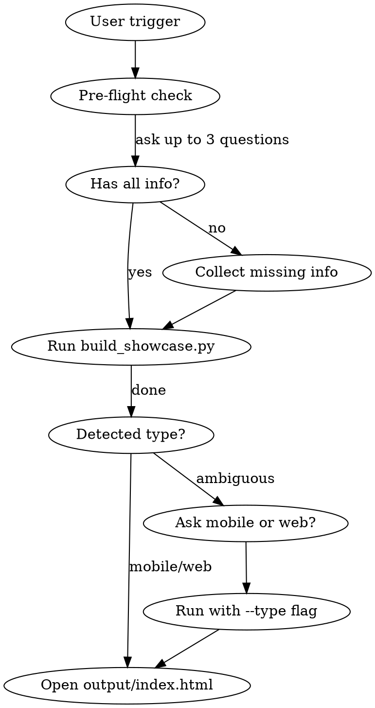

# stitch-showcase

Converts Google Stitch exports (zips with `code.html` + `screen.png`) into a navigable showcase with `index.html` + `viewer.html`.

## Prerequisites

Scripts require Python 3.8+. No external dependencies (stdlib only).

## Workflow



## Steps

### 1. Pre-flight Check (ask BEFORE running anything)

Ask only what's missing — skip questions already answered in the user's message:

**Q1 — Source folder** (if not provided):
```
Where are the Stitch zips? (full or relative path)
```

**Q2 — Mobile or web?** (if DESIGN.md is absent or ambiguous):
```
Is this a mobile app or a web dashboard?
```

**Q3 — Project name** (only if no DESIGN.md and no `--name` passed):
```
What's the project name for the showcase header?
```

### 2. Check for DESIGN.md

Look for `DESIGN.md` in the source folder. If present, it provides:
- Project name
- Type detection (mobile/web)
- Screen list with descriptions
- Color palette (accent color)

### 2b. Suggest Sections (almost always required)

**Always check** whether DESIGN.md has a usable `## Screens` section with `### Group` H3 headers.
A DESIGN.md that only contains typography, color tokens, or design system notes does NOT count — that's a design doc, not a screen inventory.

Run `--init` + improve sections whenever:
- No DESIGN.md exists
- DESIGN.md exists but has no `## Screens` section
- DESIGN.md has a `## Screens` section but no H3 groups (`###`) inside it
- DESIGN.md is a design system / brand doc (contains "Typography", "Color Palette", "Design System" headings but no slug list)

Steps:
1. Run `build_showcase.py /path --init` to generate a skeleton with all detected slugs
2. Read the generated DESIGN.md — review every slug
3. Using domain knowledge about the app, reorganize slugs into 5–10 logical sections (not just keyword overlap)
   - Group by user journey: Onboarding → Home → Core feature → Secondary features → Settings/Profile
   - Variants (dark/light) of the same screen go in the same section
   - Aim for 2–5 screens per section; avoid "Other" with more than 3 screens
4. Write the improved DESIGN.md — **ask the user to confirm before overwriting if they already have content**
5. Run the full build

### 3. Run the build script

The script accepts either a **folder** or a **zip file** directly:

```bash
# Folder of individual zips or pre-extracted screen folders
python ~/.claude/skills/stitch-showcase/scripts/build_showcase.py /path/to/folder

# Single mega-zip (zip containing all screens as subfolders)
python ~/.claude/skills/stitch-showcase/scripts/build_showcase.py /path/to/export.zip
```

With explicit type if ambiguous:
```bash
python ~/.claude/skills/stitch-showcase/scripts/build_showcase.py /path/to/folder --type mobile
python ~/.claude/skills/stitch-showcase/scripts/build_showcase.py /path/to/folder --type web
```

With project name if no DESIGN.md:
```bash
python ~/.claude/skills/stitch-showcase/scripts/build_showcase.py /path/to/folder --name "My App" --type mobile
```

With watch mode (auto-rebuild on changes):
```bash
python ~/.claude/skills/stitch-showcase/scripts/build_showcase.py /path/to/folder --watch
```

Generate DESIGN.md skeleton:
```bash
python ~/.claude/skills/stitch-showcase/scripts/build_showcase.py /path/to/folder --init
```

**Supported input structures (all handled automatically):**
| Structure | Example |
|-----------|---------|
| Folder of individual zips | `folder/login.zip`, `folder/home.zip` |
| Folder of pre-extracted screen folders | `folder/login/code.html`, `folder/home/code.html` |
| Single mega-zip (Stitch "Export all") | `export.zip → stitch/screen1/code.html, stitch/screen2/code.html` |
| Single screen zip | `screen.zip → code.html + screen.png` |

### 4. Output structure

The script creates next to the source folder:
```
showcase-mobile/          ← or showcase-web/
├── index.html            ← open this in browser
├── viewer.html
├── DESIGN.md             ← copy
└── assets/
    ├── splash_screen.html
    ├── splash_screen.png
    ├── login.html
    ├── login.png
    └── ...
```

Source folder with original zips is **never touched**.

### 5. Verification

Confirm with the user:
- ✅ Open `index.html` — thumbnails visible and correct
- ✅ Click a screen → viewer opens with title/description in header
- ✅ "← Back" button closes the viewer tab (`window.close()`)
- ✅ Mobile: phone frame visible (390px centered); Web: iframe fills viewport

### 5b. Enrich Descriptions (required when descriptions are poor)

After build, open `index.html` mentally and scan the card descriptions:
- If any card shows **no description**, or shows a description that is **just a UI label** (e.g. "SpinningIntermedio", "Mi Membresía", "Home", "Login") — those are not useful descriptions.
- For each poor/missing description: read the corresponding `assets/{slug}.png` screenshot and write a 1-sentence description that explains what the screen is for and what the user can do there.
- Offer to persist them to DESIGN.md under `## Screens` for future rebuilds (write the improved DESIGN.md and rebuild if the user agrees).

A good description answers: *what does this screen do for the user?* Not just what's on it.

## Screen Grouping

Screens are grouped into sections in this priority order:

1. **`DESIGN.md` sections** (best result) — explicit `### Section Name` blocks under `## Screens`
2. **Auto-grouping** (fallback) — keyword overlap between slugs; screens sharing a meaningful word are grouped together

When auto-grouping applies, offer to improve it:
- List the detected screen names for the user
- Suggest logical section groupings based on the app domain
- Write the sections to `DESIGN.md` in the source folder
- Re-run the script to apply them

**DESIGN.md section format for explicit grouping:**
```markdown
## Screens
### Onboarding
- splash_screen
- welcome

### Login & Registration
- login
- signup
- forgot_password

### Home
- home
- home_oscuro
```

The script merges DESIGN.md sections with slug auto-detection — slugs not listed in any section appear in an "Other screens" group at the end.

## Description Sources (priority)

1. `DESIGN.md` — screen list with descriptions
2. Individual `{num}-{name}.md` in source folder (per-screen prompt files)
3. `<meta name="description">` or `<meta property="og:description">` inside the HTML
4. First `<h1>` or `<h2>` visible text in the HTML body
5. `<title>` tag (skipped if generic: "Untitled", "index", "screen", etc.)
6. First meaningful visible text phrase found in the HTML body (strips scripts/styles/SVGs)
7. Formatted slug fallback ("splash_screen" → "Splash Screen")

Stitch-exported HTML rarely has `<title>` or meta descriptions — steps 4 and 6 are the most useful for those files.

## DESIGN.md Format

```markdown
# Project Name

## Type
mobile  ← or "web"

## Screens
### Onboarding
- splash_screen
- login

### Home
- home_dashboard

## Colors
- Primary: #FDD900
- Background: #0A0A0A

## Typography
- **Inter**
```

The parser also accepts:
- Free-form bullets/numbered lists under `## Screens`
- Markdown table format: `| slug | title | description |`
- Color tokens in Stitch format: `` `primary-container` (#FDD900) `` or bare `surface (#0B1326)`
  - Token named `primary-*` → accent color for tabs and hover
  - Token named `surface` or `background` → used to compute smart showcase theme

The `--init` flag auto-generates a skeleton DESIGN.md from detected slugs.

## Color Strategy

**Do NOT use brand colors for showcase backgrounds** — if the app's background matches the showcase background, thumbnails disappear.

| Element | Value |
|---------|-------|
| Page background | Smart: dark (`#0d0d0d`) if app surface is light, light (`#f5f5f5`) if app surface is dark |
| Card background | `#1a1a1a` (dark mode) / `#ffffff` (light mode) |
| Accent (tabs, hover, borders) | From DESIGN.md color token `primary-*` or `colors.primary` → fallback `#6366f1` |
| Large surfaces | Always neutral — never brand color |

The smart default theme is computed from the `surface` color token luminance: dark surface (luminance < 100) → showcase opens in light mode for contrast, and vice versa. The user's preference is saved in `localStorage` and overrides the default on subsequent visits.

## Mobile vs Web Detection

- Keywords in DESIGN.md: "mobile", "iOS", "Android", "app"
- Viewport meta tag: `width=device-width` + `user-scalable=no` in HTML files
- If ambiguous → ask user (pre-flight Q2)

## Scripts

| Script | Purpose |
|--------|---------|
| `scripts/build_showcase.py` | Main orchestrator — run this |
| `scripts/extract_zips.py` | Extracts and renames zips → assets/ |
| `scripts/parse_design_md.py` | Parses DESIGN.md → metadata dict |

**Flags for `build_showcase.py`:**

| Flag | Description |
|------|-------------|
| `--type mobile\|web` | Force type detection instead of auto-detecting |
| `--name "Title"` | Set project name when no DESIGN.md is present |
| `--watch` | Auto-rebuild on file changes (Ctrl+C to stop) |
| `--init` | Generate a DESIGN.md skeleton from detected screen slugs |

## Reference Templates

| Template | Used when |
|----------|-----------|
| `references/index-mobile.html` | Mobile showcase — smart theme, section tabs, grid/list toggle |
| `references/index-web.html` | Web showcase — smart theme, section tabs, grid/list toggle |
| `references/viewer-mobile.html` | Viewer with 390px phone frame, prev/next, fullscreen |
| `references/viewer-web.html` | Viewer with full-width iframe + browser chrome, prev/next, fullscreen |

## Common Errors

| Problem | Solution |
|---------|----------|
| No zips found | Verify zips are in the root folder, not subfolders |
| Broken thumbnails | `screen.png` must be inside the zip alongside `code.html` |
| Ambiguous type | Pass `--type mobile` or `--type web` explicitly |
| Empty DESIGN.md | Pass `--name` and `--type` via CLI; descriptions inferred from HTML |
| Encoding errors | Stitch HTML files use UTF-8; verify terminal encoding matches |
