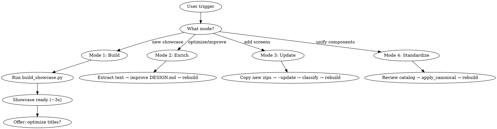

# stitch-showcase

Converts Google Stitch exports (zips with `code.html` + `screen.png`) into a navigable showcase with `index.html` + `viewer.html` + `catalog.html`.

**Architecture**: Python script generates all HTML from pre-built templates in ~3 seconds. AI enrichment (descriptions, sections, hero text) is **optional and on-demand** — only when the user asks to optimize. The AI NEVER writes index.html or viewer.html from scratch.

## Prerequisites

Scripts require Python 3.8+. No external dependencies (stdlib only).

## Workflow: Four Modes



**CRITICAL**: Always run `build_showcase.py` WITHOUT `--context` to generate HTMLs from templates. The `--context` flag is ONLY for debugging/inspecting the data JSON. NEVER have the AI write index.html or viewer.html manually — the templates handle layout, grid, viewer, theme, tabs, search, and all interactive features.

## Mode 1: Build (default — instant)

**Triggers**: "arma el muestrario", "build the showcase", user gives a zip/folder path, or any request to create a new showcase.

This is the default mode. No AI analysis needed — the script handles everything with smart defaults.

Steps:
1. Identify the source path from the user's message
2. Run the build script — **nothing else**:
   ```bash
   python ~/.claude/skills/stitch-showcase/scripts/build_showcase.py /path/to/source
   ```
3. Parse the script output to get the `showcase/` path
4. Open the showcase in the default browser:
   ```bash
   open /path/to/showcase/index.html
   ```
5. Tell the user the showcase is ready and offer to optimize titles and descriptions

**That's it.** No pre-flight questions, no DESIGN.md enrichment, no `--extract-text`, no `--init`.

Only ask `--type` or `--name` if the **script fails** or the **user explicitly wants to override**:
```bash
# Only if script fails to detect type or user requests it
python ~/.claude/skills/stitch-showcase/scripts/build_showcase.py /path/to/source --type mobile
python ~/.claude/skills/stitch-showcase/scripts/build_showcase.py /path/to/source --name "My App" --type mobile
```

## Mode 2: Enrich (on-demand — user asks)

**Triggers**: "optimiza", "optimiza el showcase", "mejora las descripciones", "enrich", "optimize titles", "mejora el DESIGN.md", or any request to improve an existing showcase's content quality.

This mode improves the AI-generated content in DESIGN.md and rebuilds the showcase with enriched data.

Steps:
1. Find the source folder (from the user's message or the project's `showcase.json`)
2. Run `--extract-text` to get screen summaries:
   ```bash
   python ~/.claude/skills/stitch-showcase/scripts/build_showcase.py /path/to/source --extract-text
   ```
   This generates `screen_summaries.txt` — a compact text file with visible text from all screen HTMLs.
3. Read the existing `DESIGN.md` (in the source folder) + `screen_summaries.txt`
4. **Keep existing sections as-is** — do NOT re-group screens. Only improve content within each section:
   - **De-mangle titles**: `configuraci_n` → "Configuración", `membres_as_y_pagos` → "Membresías y Pagos"
   - **Write real descriptions**: From the extracted text, write a 1-sentence Spanish description for each screen explaining what it does for the user (NOT just a UI label). Example: "Panel principal del miembro con estado de membresía, próximas clases y accesos rápidos."
   - **Fix the `Title | Description` format** for mangled slugs (see format below)
5. **Update the project description** at the top of DESIGN.md — this feeds the hero section. It should describe the full scope of the project based on the screens' content.
6. **Verify colors/fonts**: Scan the screen HTMLs for hex colors in CSS variables and font families. Update `## Colors` and `## Typography` sections if they're missing or incomplete.
7. Re-run the build to regenerate HTMLs with enriched data:
   ```bash
   python ~/.claude/skills/stitch-showcase/scripts/build_showcase.py /path/to/source
   ```
8. Done — tell the user the showcase has been updated with improved descriptions

**Mangled slugs (Stitch replaces accented characters with `_`):**

Google Stitch strips accent characters from filenames, replacing each with `_`. When you see slugs like `confirmaci_n_de_reserva` or `men_m_s`, reconstruct the correct display title and write it explicitly using the `Title | Description` format:

```markdown
### Cuenta
- configuraci_n_oscuro: Configuración | Ajustes de cuenta, notificaciones y preferencias del usuario.
- notificaci_n_oscuro: Notificación | Centro de alertas y mensajes recibidos.
- esc_ner_oscuro: Escáner | Lector de código QR para acceso o verificación.
```

The parser splits on ` | ` — everything before is the display title, everything after is the description. For slugs without mangled characters, the plain `- slug: description` format is fine (title is inferred from the slug automatically).

## Mode 3: Update (add new screens to an existing showcase)

**Triggers**: "add these new screens", "el cliente pidió una pantalla más", "coloca este zip en el proyecto", "agrégalos al muestrario", or any similar update request.

Steps:
1. Copy the new zip(s) into the same source folder as the existing screens
2. Run `build_showcase.py /path/to/source --update`
   - Extracts new zips (existing screens skipped via mtime)
   - Detects slugs not yet in any DESIGN.md section
   - Appends them under `### Por Clasificar` in DESIGN.md
3. Run `build_showcase.py /path/to/source --extract-text` to generate `screen_summaries.txt` with text from ALL screens (existing + new)
4. Read `screen_summaries.txt` and the current DESIGN.md
5. For each new slug in `### Por Clasificar`:
   - Move it to the correct existing section based on its content
   - If the slug is a variant of an existing screen (e.g. login_v2), put it in the same section
   - If it's a genuinely new section topic, create a new `### Section` header
   - Add `Title | Description` using the extracted text (especially if slug has mangled chars)
6. **Update the project description** at the top of DESIGN.md to reflect the new screens. The hero section uses this text — it should describe the full scope of the project including the additions.
7. Run the full build: `build_showcase.py /path/to/source`
8. Confirm with the user that the new screens appear correctly in the showcase

## Mode 4: Standardize Components

**Triggers**: "standardize the navbars", "make all footers the same", "usa el navbar del home", "estandariza los botones", or similar.

Steps:
1. Open `catalog.html` in the browser — review the comparison view
2. User decides which variant to use as canonical
3. Run `apply_canonical.py` to apply the chosen canonical:

```bash
# Structural components (navbar, footer, sidebar, tabbar)
python ~/.claude/skills/stitch-showcase/scripts/apply_canonical.py /path/to/showcase/assets/ navbar home_screen

# Atomic components (button, input, heading, etc.)
python ~/.claude/skills/stitch-showcase/scripts/apply_canonical.py /path/to/showcase/assets/ button home_screen

# Target specific screens only
python ~/.claude/skills/stitch-showcase/scripts/apply_canonical.py /path/to/showcase/assets/ navbar home_screen --targets login settings profile
```

4. Rebuild the showcase: `build_showcase.py /path/to/source`
5. Verify the catalog shows fewer variants / more items in "Already Unified"
6. Repeat until all components are standardized

## Verification

Confirm with the user:
- Open `index.html` — thumbnails visible and correct
- Design system section shows color relationships and type specimen (not just swatches)
- Click a screen → viewer opens with correct default frame (phone for mobile, browser chrome for web)
- View mode toggle switches between mobile/web display in both index and viewer
- Prev/next and keyboard shortcuts work in viewer
- Light/dark mode toggles and persists
- Section tabs filter correctly
- Search filters cards
- "← Back" button closes the viewer tab

## Component Catalog & Comparison (automatic)

The catalog is generated automatically as part of every build. Open `catalog.html` to:

- **Browse all components** organized by type: Structural (navbars, footers, sidebars), Atomic (buttons, headings, inputs, badges, links, icons), Composite (cards, CTAs, heroes, testimonials)
- **Compare variants** side-by-side with styled previews (original Tailwind CSS), canonical badges, similarity scores, and screen counts
- **See what's unified** — components with only one variant appear in a collapsed "Already Unified" section
- **Copy component HTML** for use in other projects

## Build Script Reference

### Running the build

```bash
# Point to the project root — the script discovers the source automatically
python ~/.claude/skills/stitch-showcase/scripts/build_showcase.py /path/to/project

# Or point directly to the folder with zips/screens
python ~/.claude/skills/stitch-showcase/scripts/build_showcase.py /path/to/project/stitch

# Single mega-zip (zip containing all screens as subfolders)
python ~/.claude/skills/stitch-showcase/scripts/build_showcase.py /path/to/export.zip
```

### Flags

| Flag | Description |
|------|-------------|
| `--type mobile\|web` | Set default view mode instead of auto-detecting |
| `--name "Title"` | Set project name when no DESIGN.md is present |
| `--init` | Generate a DESIGN.md skeleton from detected screen slugs |
| `--update` | Detect new screens not yet in DESIGN.md and append under `### Por Clasificar` |
| `--extract-text` | Extract visible text from screen HTMLs → `screen_summaries.txt` (for LLM consumption) |
| `--context` | (Debug only) Generate showcase_context.json without building HTML — do NOT use for normal builds |
| `--watch` | Auto-rebuild on file changes (Ctrl+C to stop) |

**Note**: Component detection and catalog generation are now automatic — no `--catalog` or `--components` flags needed. Every build produces `catalog.html` alongside `index.html` and `viewer.html`.

### Output structure

The script creates a single `showcase/` directory next to the source folder:
```
showcase/                         ← single output dir (view mode toggle inside)
├── index.html                    ← open this in browser (gallery + design system)
├── viewer.html                   ← individual screen viewer
├── catalog.html                  ← component catalog with comparison view
├── component_catalog.json        ← atomic + composite + cluster data
├── shared_components.json        ← structural component variants
├── DESIGN.md                     ← copy from source
└── assets/
    ├── splash_screen.html
    ├── splash_screen.png
    ├── login.html
    ├── login.png
    └── ...
```

Source folder with original zips is **never touched**.

### Source discovery

The script accepts **any folder in the project** — it doesn't need to be the exact folder with screens. Discovery order:
1. If the given path has screens (zips or `code.html` folders) → use it directly
2. If `showcase.json` exists in the given path or its parent → follow its `source` field
3. Auto-discover: scan one level of subdirectories for screens (skips `showcase`, `showcase-mobile`, `showcase-web` output dirs)
4. Clear error with a suggestion to create `showcase.json`

### Supported input structures

| Structure | Example |
|-----------|---------|
| Project root with `showcase.json` | `project/showcase.json` → `{"source": "stitch"}` |
| Folder of individual zips | `folder/login.zip`, `folder/home.zip` |
| Folder of pre-extracted screen folders | `folder/login/code.html`, `folder/home/code.html` |
| Single mega-zip (Stitch "Export all") | `export.zip → stitch/screen1/code.html, stitch/screen2/code.html` |
| Single screen zip | `screen.zip → code.html + screen.png` |

## Screen Grouping

Screens are grouped into sections in this priority order:

1. **`DESIGN.md` sections** (best result) — explicit `### Section Name` blocks under `## Screens`
2. **Auto-grouping** (fallback) — keyword overlap between slugs; screens sharing a meaningful word are grouped together

When auto-grouping applies, offer to improve it:
- List the detected screen names for the user
- Suggest logical section groupings based on the app domain
- Write the sections to `DESIGN.md` in the source folder
- Re-run the script to apply them

**DESIGN.md section format for explicit grouping:**
```markdown
## Screens
### Onboarding
- splash_screen
- welcome

### Login & Registration
- login
- signup
- forgot_password

### Home
- home
- home_oscuro
```

The script merges DESIGN.md sections with slug auto-detection — slugs not listed in any section appear in an "Other screens" group at the end.

## Description Sources (priority)

1. `DESIGN.md` — screen list with descriptions
2. Individual `{num}-{name}.md` in source folder (per-screen prompt files)
3. `<meta name="description">` or `<meta property="og:description">` inside the HTML
4. First `<h1>` or `<h2>` visible text in the HTML body
5. `<title>` tag (skipped if generic: "Untitled", "index", "screen", etc.)
6. First meaningful visible text phrase found in the HTML body (strips scripts/styles/SVGs)
7. Formatted slug fallback ("splash_screen" → "Splash Screen")

Stitch-exported HTML rarely has `<title>` or meta descriptions — steps 4 and 6 are the most useful for those files.

## showcase.json

Optional config file in the project root. Tells the script where to find screens, the project type, and name — so you can point the script at any folder in the project.

```json
{
  "source": "stitch",
  "type": "mobile",
  "name": "SNAP Gym"
}
```

| Field | Required | Description |
|-------|----------|-------------|
| `source` | yes | Relative path from the JSON file to the folder with screens |
| `type` | no | `"mobile"` or `"web"` (overridden by `--type` CLI flag) |
| `name` | no | Project name (overridden by `--name` CLI flag or DESIGN.md) |

The `--init` flag generates this file automatically alongside DESIGN.md.

## DESIGN.md Format

```markdown
# Project Name

## Type
mobile  ← or "web"

## Screens
### Onboarding
- splash_screen
- login

### Home
- home_dashboard

## Colors
- Primary: #FDD900
- Background: #0A0A0A

## Typography
- **Inter**
```

The parser also accepts:
- Free-form bullets/numbered lists under `## Screens`
- Markdown table format: `| slug | title | description |`
- Color tokens in Stitch format: `` `primary-container` (#FDD900) `` or bare `surface (#0B1326)`
  - Token named `primary-*` → accent color for tabs and hover
  - Token named `surface` or `background` → used to compute smart showcase theme

The `--init` flag auto-generates a skeleton DESIGN.md from detected slugs.

## Color Strategy

**Do NOT use brand colors for showcase backgrounds** — if the app's background matches the showcase background, thumbnails disappear.

| Element | Value |
|---------|-------|
| Page background | Smart: dark (`#0d0d0d`) if app surface is light, light (`#f5f5f5`) if app surface is dark |
| Card background | `#1a1a1a` (dark mode) / `#ffffff` (light mode) |
| Accent (tabs, hover, borders) | From context `color_tokens.accent` or `colors.primary` → fallback `#6366f1` |
| Large surfaces | Always neutral — never brand color |

The smart default theme is computed from the `surface` color token luminance: dark surface (luminance < 100) → showcase opens in light mode for contrast, and vice versa. The user's preference is saved in `localStorage` and overrides the default on subsequent visits.

## Mobile vs Web Detection

### Project-level (from DESIGN.md):
- Keywords: "mobile", "iOS", "Android", "app"
- If ambiguous → pass `--type` flag

### Per-screen (from HTML analysis):
- Viewport meta `user-scalable=no`, `maximum-scale=1` → mobile
- Fixed widths 375-430px → mobile
- Desktop breakpoints, sidebars → web
- Stored as `detected_type` per screen in context JSON

## Scripts

| Script | Purpose |
|--------|---------|
| `scripts/build_showcase.py` | Main orchestrator — generates index.html + viewer.html |
| `scripts/extract_zips.py` | Extracts and renames zips → assets/ |
| `scripts/extract_text.py` | Extracts visible text from HTML files → compact summaries for LLM |
| `scripts/detect_components.py` | Detects shared components (nav, footer, tabbar) across screens |
| `scripts/extract_catalog.py` | Extracts atomic + composite components for visual catalog |
| `scripts/component_utils.py` | Shared HTML parsing helpers (stdlib html.parser) |
| `scripts/parse_design_md.py` | Parses DESIGN.md → metadata dict |

## Reference Templates

| Template | Purpose |
|----------|---------|
| `references/index.html` | Unified showcase — hero, design system, section tabs, grid/list toggle, mobile/web view mode toggle |
| `references/viewer.html` | Unified viewer — phone frame + browser chrome toggled by view mode, prev/next, fullscreen |
| `references/catalog-template.html` | Visual component catalog with tabs, previews, code snippets |

## Reference Guides (design documentation)

| Guide | Purpose |
|-------|---------|
| `references/01-navbar.md` through `references/09-quality-standards.md` | Design decisions documentation for each section |
| `references/10-component-standardization.md` | Component standardization design doc |
| `references/11-component-catalog.md` | Component catalog design doc |

## Common Errors

| Problem | Solution |
|---------|----------|
| No zips found | Point to project root (with `showcase.json`) or directly to the screens folder |
| Broken thumbnails | `screen.png` must be inside the zip alongside `code.html` |
| Ambiguous type | Pass `--type mobile` or `--type web` explicitly |
| Empty DESIGN.md | Pass `--name` and `--type` via CLI; descriptions inferred from HTML |
| Encoding errors | Stitch HTML files use UTF-8; verify terminal encoding matches |
| Web screens in phone frame | Use `--type web` to force web viewer |
| Poor/missing descriptions | Use Mode 2 (Enrich): extract text → improve DESIGN.md → rebuild |
