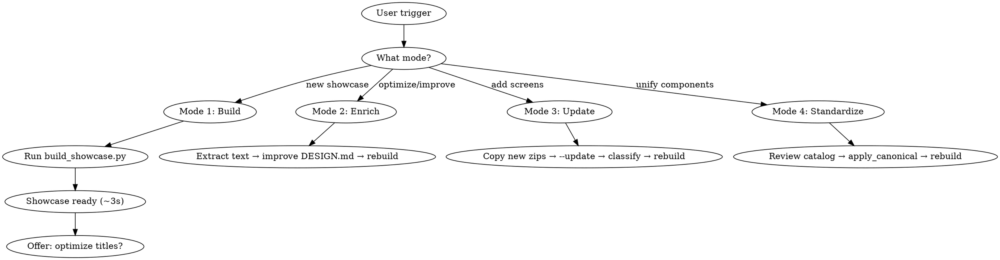

# stitch-showcase

Converts Google Stitch exports (zips with `code.html` + `screen.png`) into a navigable showcase with `index.html` + `viewer.html` + `catalog.html`.

**Architecture**: a Python script generates all HTML from pre-built templates in ~3 seconds. AI enrichment (descriptions, sections, hero text) is **optional and on-demand** — only when the user asks to optimize.

## Prerequisites

Scripts require Python 3.8+. No external dependencies (stdlib only).

## Script paths

All commands below use `<SKILL_DIR>/scripts/...` as a placeholder. Replace `<SKILL_DIR>` with the absolute "Base directory for this skill" shown in the system message when this skill loads (e.g. `~/.claude/plugins/cache/<plugin>/<version>/skills/stitch-showcase` for plugin installs, or `~/.claude/skills/stitch-showcase` for standalone installs). Do not assume `~/.claude/skills/...` — the path differs by install type.

## Workflow: Four Modes


```dot
digraph showcase {
    "User trigger" -> "What mode?";
    "What mode?" -> "Mode 1: Build" [label="new showcase"];
    "What mode?" -> "Mode 2: Enrich" [label="optimize/improve"];
    "What mode?" -> "Mode 3: Update" [label="add screens"];
    "What mode?" -> "Mode 4: Standardize" [label="unify components"];

    "Mode 1: Build" -> "Run build_showcase.py";
    "Run build_showcase.py" -> "Showcase ready (~3s)";
    "Showcase ready (~3s)" -> "Offer: optimize titles?";

    "Mode 2: Enrich" -> "Extract text → improve DESIGN.md → rebuild";

    "Mode 3: Update" -> "Copy new zips → --update → classify → rebuild";

    "Mode 4: Standardize" -> "Review catalog → apply_canonical → rebuild";
}
```

Two things about this that are easy to get wrong and expensive to undo:

Run `build_showcase.py` **without** `--context`, since that's the invocation that writes the HTML. `--context` only dumps the data JSON for inspection, so a run with it leaves you with no showcase and no error saying why.

Don't write `index.html` or `viewer.html` by hand. The templates already carry the layout, grid, viewer, theme, tabs, search and every interactive behavior, and every build regenerates both files — so hand-written HTML costs a lot to produce and disappears on the next rebuild.

## Mode 1: Build (default — instant)

**Triggers**: "arma el muestrario", "build the showcase", user gives a zip/folder path, or any request to create a new showcase.

This is the default mode. No AI analysis needed — the script handles everything with smart defaults.

Steps:

1. Identify the source path from the user's message
2. Run the build script — **nothing else**:
   ```bash
   python <SKILL_DIR>/scripts/build_showcase.py /path/to/source
   ```
3. Parse the script output to get the `showcase/` path
4. Open the showcase in the default browser:
   ```bash
   open /path/to/showcase/index.html
   ```
5. Tell the user the showcase is ready and offer to optimize titles and descriptions

**That's it.** No pre-flight questions, no DESIGN.md enrichment, no `--extract-text`, no `--init`.

Only ask `--type` or `--name` if the **script fails** or the **user explicitly wants to override**. Full flag reference in [`references/15-build-flags.md`](references/15-build-flags.md).

## Mode 2: Enrich (on-demand — user asks)

**Triggers**: "optimiza", "optimiza el showcase", "mejora las descripciones", "enrich", "optimize titles", "mejora el DESIGN.md", or any request to improve an existing showcase's content quality.

This mode improves the AI-generated content in DESIGN.md and rebuilds the showcase with enriched data.

Steps:

1. Find the source folder (from the user's message or the project's `showcase.json`)
2. Run `--extract-text` to get screen summaries:
   ```bash
   python <SKILL_DIR>/scripts/build_showcase.py /path/to/source --extract-text
   ```
   This generates `screen_summaries.txt` — a compact text file with visible text from all screen HTMLs.
3. Read the existing `DESIGN.md` (in the source folder) + `screen_summaries.txt`
4. **Keep existing sections as-is** — do NOT re-group screens. Only improve content within each section:
   - **Write real descriptions**: From the extracted text, write a 1-sentence Spanish description for each screen explaining what it does for the user (NOT just a UI label). Example: "Panel principal del miembro con estado de membresía, próximas clases y accesos rápidos."
   - **Titles are handled by the script** — `scripts/slug_demangle.py` already converts mangled slugs like `configuraci_n_oscuro` → `"Configuración Oscuro"` and `membres_as` → `"Membresías"`. Use the `Title | Description` override only when the demangler can't infer the right title (rare word) or you want a title different from what the slug would yield.
5. **Update the project description** at the top of DESIGN.md — this feeds the hero section. It should describe the full scope of the project based on the screens' content.
6. **Verify colors/fonts**: Scan the screen HTMLs for hex colors in CSS variables and font families. Update `## Colors` and `## Typography` sections if they're missing or incomplete.
7. Re-run the build to regenerate HTMLs with enriched data:
   ```bash
   python <SKILL_DIR>/scripts/build_showcase.py /path/to/source
   ```
8. Done — tell the user the showcase has been updated with improved descriptions

**Title override format (`Title | Description`):**

When the demangler doesn't cover a slug (uncommon word or composite), provide both pieces explicitly. The parser splits on ` | ` — everything before is the display title, everything after is the description:

```markdown
### Cuenta
- weird_man_leado_slug: Título Correcto | Descripción de la pantalla.
```

For slugs that the demangler already handles correctly, the plain `- slug: description` form is enough. Full DESIGN.md format in [`references/16-design-md-format.md`](references/16-design-md-format.md).

## Mode 3: Update (add new screens to an existing showcase)

**Triggers**: "add these new screens", "el cliente pidió una pantalla más", "coloca este zip en el proyecto", "agrégalos al muestrario", or any similar update request.

Steps:

1. Copy the new zip(s) into the same source folder as the existing screens
2. Run `build_showcase.py /path/to/source --update`
   - Extracts new zips (existing screens skipped via mtime)
   - Detects slugs not yet in any DESIGN.md section
   - Appends them under `### Por Clasificar` in DESIGN.md
3. Run `build_showcase.py /path/to/source --extract-text` to generate `screen_summaries.txt` with text from ALL screens (existing + new)
4. Read `screen_summaries.txt` and the current DESIGN.md
5. For each new slug in `### Por Clasificar`:
   - Move it to the correct existing section based on its content
   - If the slug is a variant of an existing screen (e.g. login_v2), put it in the same section
   - If it's a genuinely new section topic, create a new `### Section` header
   - Add `Title | Description` using the extracted text (especially if slug has mangled chars)
6. **Update the project description** at the top of DESIGN.md to reflect the new screens. The hero section uses this text — it should describe the full scope of the project including the additions.
7. Run the full build: `build_showcase.py /path/to/source`
8. Confirm with the user that the new screens appear correctly in the showcase

## Mode 4: Standardize Components

**Triggers**: "standardize the navbars", "make all footers the same", "usa el navbar del home", "estandariza los botones", or similar.

Open `catalog.html` to compare variants, decide a canonical, then run `apply_canonical.py` and rebuild. **Full workflow in [`references/10-component-standardization.md`](references/10-component-standardization.md).**

## Verification

Confirm with the user:

- Open `index.html` — thumbnails visible and correct
- Design system section shows color relationships and type specimen (not just swatches)
- Click a screen → viewer opens with correct default frame (phone for mobile, browser chrome for web)
- View mode toggle switches between mobile/web display in both index and viewer
- Prev/next and keyboard shortcuts work in viewer
- Light/dark mode toggles and persists
- Section tabs filter correctly
- Search filters cards
- "← Back" button closes the viewer tab

## Component Catalog & Comparison (automatic)

The catalog is generated automatically as part of every build. Open `catalog.html` to browse components by type (Structural, Atomic, Composite), compare variants side-by-side with similarity scores, see what's already unified, and copy component HTML. Design details in [`references/11-component-catalog.md`](references/11-component-catalog.md).

## Scripts

| Script | Purpose |
|--------|---------|
| `scripts/build_showcase.py` | Main orchestrator — generates index.html + viewer.html |
| `scripts/extract_zips.py` | Extracts and renames zips → assets/ |
| `scripts/extract_text.py` | Extracts visible text from HTML files → compact summaries for LLM |
| `scripts/detect_components.py` | Detects shared components (nav, footer, tabbar) across screens |
| `scripts/extract_catalog.py` | Extracts atomic + composite components for visual catalog |
| `scripts/component_utils.py` | Shared HTML parsing helpers (stdlib html.parser) |
| `scripts/parse_design_md.py` | Parses DESIGN.md → metadata dict |
| `scripts/slug_demangle.py` | De-mangles Stitch slugs back to accented titles (`configuraci_n` → `Configuración`) |
| `scripts/apply_canonical.py` | Applies a canonical component variant across selected screens |

## Reference Templates

| Template | Purpose |
|----------|---------|
| `references/index.html` | Unified showcase — hero, design system, section tabs, grid/list toggle, mobile/web view mode toggle |
| `references/viewer.html` | Unified viewer — phone frame + browser chrome toggled by view mode, prev/next, fullscreen |
| `references/catalog-template.html` | Visual component catalog with tabs, previews, code snippets |

## Reference Guides

| Guide | Purpose |
|-------|---------|
| `references/01-navbar.md` through `references/09-quality-standards.md` | Design decisions documentation for each section |
| `references/07-theme-system.md` | Theme system, smart default, **showcase color strategy** (never use brand colors for surfaces) |
| `references/08-type-detection.md` | Mobile vs web detection (project-level keywords + per-screen HTML signals) |
| `references/10-component-standardization.md` | Component standardization design + **Mode 4 workflow** |
| `references/11-component-catalog.md` | Component catalog design doc |
| `references/12-video-embedding.md` | How to embed videos in slots (autoplay, aspect ratio, AV1 → H.264) |
| `references/13-language-detection.md` | How `<html lang>` is resolved (auto-detect + overrides) |
| `references/14-troubleshooting-known-issues.md` | Known issues and workarounds |
| `references/15-build-flags.md` | **Build script reference**: flags, output structure, source discovery, supported input layouts |
| `references/16-design-md-format.md` | **DESIGN.md & showcase.json formats**: project metadata, screen grouping, description sources priority |

## Common Errors

| Problem | Solution |
|---------|----------|
| No zips found | Point to project root (with `showcase.json`) or directly to the screens folder |
| Broken thumbnails | `screen.png` must be inside the zip alongside `code.html` |
| Ambiguous type | Pass `--type mobile` or `--type web` explicitly |
| Empty DESIGN.md | Pass `--name` and `--type` via CLI; descriptions inferred from HTML |
| Encoding errors | Stitch HTML files use UTF-8; verify terminal encoding matches |
| Web screens in phone frame | Use `--type web` to force web viewer |
| Poor/missing descriptions | Use Mode 2 (Enrich): extract text → improve DESIGN.md → rebuild |
